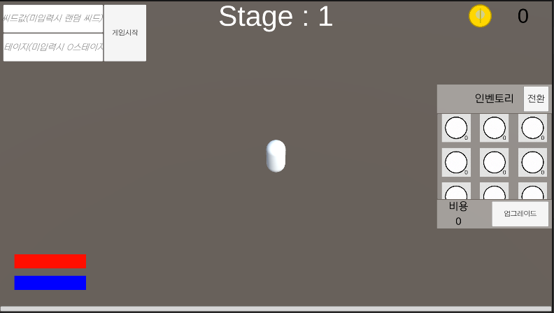

# 자동사냥 RPG

이 프로젝트는 플레이어가 직접 조작하지 않아도 “자동으로 적을 찾아 사냥”하는 RPG입니다.

---

## 스크린샷

  
*위 이미지는 프로젝트의 주요 UI를 보여줍니다.*

---

## UI 구성

- **상단**  
  - **Seed 입력 필드**: 게임 난이도나 맵 생성에 사용하는 시드를 직접 입력  
  - **Stage 입력 필드**: 진행할 스테이지 번호 입력  

- **우측**  
  - **보유 재화 표시**: 골드, 크리스탈 등 플레이어가 현재 보유한 재화 현황  
  - **인벤토리 영역**: 획득한 아이템 목록
  - **업그레이드 버튼**: 사용중인 아이템 업그레이드
  - **전환 버튼**: 인벤토리 ⇄ 스테이터스 전환  

## 주요 기능

- NavMeshAgent 기반 **자동 적 추적 및 이동**  
- 설정된 사거리 내 **자동 공격**  
- 사용자 입력에 따라 시드/스테이지 바로 변경  
- **인벤토리 관리** 및 **스테이터스 확인** UI  

---

## 테스트 단축키

|키|기능|
|:--:|:--|
|F1|체력감소|
|F2|마나감소|
|F3|겸험치 획득|
|F4|스테이지 넘거가기|
|F5|돈 추가|

---

## 알려진 이슈

- **몬스터 추적 간헐 정지 현상**  

